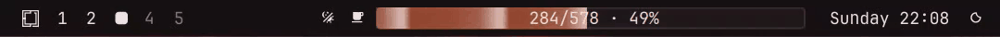
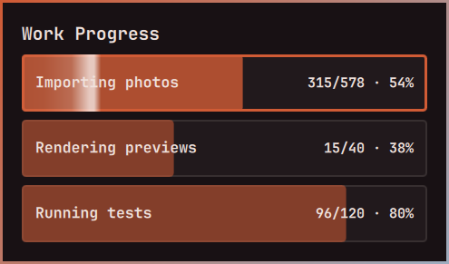

# Agent Progress

An [Omarchy](https://omarchy.org/) bar meter for long-running work, built for
people who run several coding agents at once. Any agent, script or service
reports progress with a one-line command, and the bar shows it even while the
terminal doing the work is out of sight.



- **Every step is visible.** Each time progress moves, a wave runs along the
  fill. Fast work sends several waves at once, so you can tell 1 step a second
  from 10 at a glance.
- **Several jobs at once.** The bar shows one job at a time. Click the meter
  or press Super+P to pick another; arrow keys (or I/K) move through the
  list, and Return or Escape closes it.
- **Fits the space it has.** Placed just before the bar's centre widget, the
  meter grows to fill the gap back to your workspaces and shrinks when that gap
  narrows. When it gets tight, the label drops to just the percentage.



## Install

```bash
omarchy plugin add https://github.com/benredrew/omarchy-agent-progress --enable
omarchy bar move benredrew.progress --before omarchy.clock
ln -s ~/.config/omarchy/plugins/benredrew.progress/bin/agent-progress ~/.local/bin/
```

The second line puts the meter just left of the clock, where it sizes itself
to the free space. If your bar centres on a different widget, use that
widget's ID instead of `omarchy.clock`. Anywhere else, the meter keeps a fixed
width.

The `agent-progress` command needs Python 3.11 or newer, which Omarchy already
has.

### Keyboard picker (optional)

Clicking works without this. For Super+P and the arrow keys, add the contents
of [`hypr/bindings.lua`](hypr/bindings.lua) to `~/.config/hypr/bindings.lua`.
It replaces Omarchy's default Super+P (pseudo-tiling). The arrow, I/K, Return
and Escape keys are only bound while the picker is open.

## Report progress

```bash
agent-progress start photo-import --title "Importing photos" --total 578 --unit photos
agent-progress update photo-import --current 154 --detail "RAW files"
agent-progress finish photo-import        # or: agent-progress fail photo-import
```

| Command | What it does |
|---|---|
| `start <id>` | Starts a job, or restarts one with the same ID |
| `update <id>` | Changes `--current`, `--total`, `--title`, `--detail`, `--unit` or `--state` |
| `finish <id>` | Marks the job done and takes it off the bar |
| `fail <id>` | Marks the job failed and takes it off the bar |
| `list` | Shows active jobs (`--json` for scripts) |
| `remove <id>` | Deletes a job's record |

Leave out `--total` when there is nothing to count against; the meter then
shows a running count, or "working". `--state blocked` marks a job that is
waiting on you.

Each job is one small JSON file in `~/.local/state/agent-progress/`, replaced
atomically on every update, so the bar never reads a half-written record.
Finished and failed jobs stay on disk but are hidden.

## Teach your agents

[`AGENT-PROGRESS.md`](AGENT-PROGRESS.md) is a one-page guide for coding agents
(Claude Code, Codex and others): when to report, how to name jobs, and to
always finish them. Put it somewhere your agents can read, and add a line to
your global agent instructions (`~/.claude/CLAUDE.md`, `~/.codex/AGENTS.md`):

```markdown
## Progress on the bar

For any task likely to run longer than about a minute with countable steps,
report it to the bar's progress meter with `agent-progress`, and always
`finish` or `fail` it. Read `~/.agents/AGENT-PROGRESS.md` first.
```

## Notes

- To size itself, the meter reads where the bar's left section ends. Omarchy
  doesn't expose that to plugins, so the meter finds it in the bar's own
  layout and reads only its position. If a future Omarchy release changes that
  layout, the meter stops resizing and keeps its last width.
- After editing the plugin's QML, run `omarchy restart shell`. The shell's
  automatic plugin reload can keep running the old code.

## License

MIT. See `LICENSE`.
